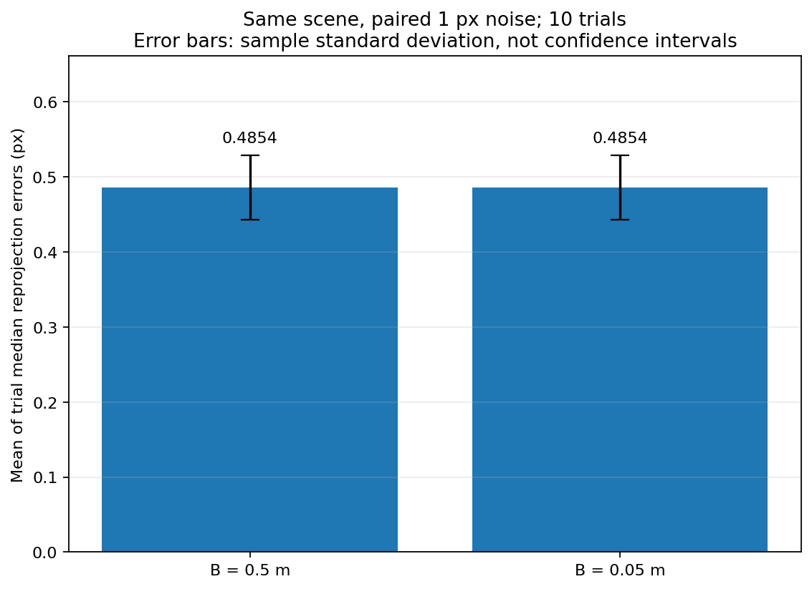

# 01｜两视图几何与 DLT 三角化

一张图像能告诉我们一个三维点落在哪条射线上，却不能单独确定它的深度。第二个视角提供另一条射线，两条约束合在一起，才有机会恢复三维点。

Day1 的实验从最清楚的条件开始：相机内外参已知，点对应关系正确，数据来自合成场景。自己实现的是 DLT 方程构造和 SVD 求解；没有特征匹配，也没有相机位姿估计。

## 1. 先固定坐标约定

本实验采用右、下、前的相机坐标轴，世界坐标到相机坐标为：

$$
X_c=RX_w+t,\qquad t=-RC.
$$

这里 $C$ 是相机中心在世界坐标中的位置，$t$ 是坐标变换的平移项。相机中心不是 $t$。

像素齐次坐标满足：

$$
\lambda\begin{bmatrix}u\\v\\1\end{bmatrix}
=K[R\mid t]\begin{bmatrix}X\\Y\\Z\\1\end{bmatrix}
=PX_h.
$$

使用像素坐标时，投影矩阵是 $P=K[R\mid t]$；使用经 $K^{-1}$ 归一化的坐标时，应配 $[R\mid t]$。两种坐标不能混用。本日不含镜头畸变。

## 2. 两个视角如何补出深度

在平行、已校正的双目特例中，视差 $d=u_1-u_2$，焦距为 $f$，基线为 $B$：

$$
Z=\frac{fB}{d},\qquad
\frac{\partial Z}{\partial d}=-\frac{Z^2}{fB}.
$$

这解释了两个现象：远处点的深度更容易受像素噪声影响；相同深度和焦距下，基线越短，同样的视差误差会造成越大的深度误差。这个公式用于解释双目特例，实际代码中的 DLT 可以处理非平行相机。

## 3. 从投影方程构造 DLT

设 $p_{i,j}^{\mathsf T}$ 为第 $i$ 台相机投影矩阵的第 $j$ 行。消去每幅图的未知尺度，两幅图共贡献四条约束：

$$
A=
\begin{bmatrix}
u_1p_{1,3}^{\mathsf T}-p_{1,1}^{\mathsf T}\\
v_1p_{1,3}^{\mathsf T}-p_{1,2}^{\mathsf T}\\
u_2p_{2,3}^{\mathsf T}-p_{2,1}^{\mathsf T}\\
v_2p_{2,3}^{\mathsf T}-p_{2,2}^{\mathsf T}
\end{bmatrix},\qquad AX_h=0.
$$

对 $A$ 做 SVD，取最小奇异值对应的右奇异向量，然后用带符号的 $W$ 还原欧氏坐标：

```python
_, singular_values, vh = np.linalg.svd(A)
Xh = vh[-1]
X = Xh[:3] / Xh[3]
```

实际实现还拒绝不独立的方程和接近无穷远的解：次小奇异值过小意味着无法唯一确定点；$|W|$ 过小不能靠加一个 epsilon 假装得到可靠深度。不能用 $|W|$ 作除数，否则会改变点的符号。

实现见 `geometry_exercise.py`，公共投影和误差计算见 `geometry_core.py`。DLT 最小化的是代数残差，不直接等价于最小化非线性像素重投影误差。

## 4. 本地实验：基线 × 像素噪声

固定 seed `20261006`，生成 300 个点，深度约 4–8 m。对比 0.5 m 和 0.05 m 两种基线，以及 0 px 和 1 px 噪声。有噪声条件各重复 10 次，两种基线共用同一组配对噪声；无噪声条件各一次。

下面的误差是“每次试验的点误差中位数，再跨试验取均值”，括号内为试验层面的样本标准差。

| 基线 B (m) | 噪声标准差 (px) | 三维误差 (m) | 重投影误差 (px) | 有限解 / 正深度比例 |
|---:|---:|---:|---:|---:|
| 0.5 | 0 | $3.57\times10^{-15}$ | $6.36\times10^{-14}$ | 1.0 / 1.0 |
| 0.5 | 1 | 0.07930（0.00386） | 0.48544（0.04297） | 1.0 / 1.0 |
| 0.05 | 0 | $2.14\times10^{-14}$ | $5.68\times10^{-14}$ | 1.0 / 1.0 |
| 0.05 | 1 | 0.79337（0.04751） | 0.48544（0.04297） | 1.0 / 1.0 |

数据见 [summary.json](results/Week2_Day1/outputs/sweep_student/summary.json)，配置见 [run_config.json](results/Week2_Day1/outputs/sweep_student/run_config.json)。




同样的 1 px 噪声下，基线缩短 10 倍，三维误差约放大 10 倍，而重投影误差几乎相同。小重投影误差只能说明估计点在图像上接近当前观测；在几何约束较弱时，深度仍可能明显偏离真值。

两组无噪声实验都能恢复到浮点精度。这里不能把“小基线”和“必然重建失败”画等号；基线与观测噪声的共同作用才是这次对照要说明的内容。

## 5. 检查与实验来源

本地 [check_student.json](results/Week2_Day1/outputs/check_student.json) 记录 **14/14 通过**，覆盖混合位姿、OpenCV 对照、坐标配对、尺度/平移符号和退化输入。检查中的 solver SHA-256 与保存的实现一致。报告说明实现曾参考 DLT 公式和参考解答；检查通过不等于完全独立推导或概念全部掌握。

以下入口名称用于追溯本地实验，完整脚本未收录于本笔记仓库。


新的实验写到自己的 `outputs/reproduce_sweep`，仓库中的 `results/` 保存已有实验快照。使用同一个输出路径再次运行会覆盖该次结果。

## 6. 学到什么，以及还没验证什么

- 三角化需要明确的坐标约定、正确配对的投影矩阵和非退化的视角。
- 有限解、正深度、像素残差和三维真值误差回答不同问题，不能只看其中一个。
- 两台相机共用错误的尺度时，图像拟合仍可以很好；米尺度需要额外约束。
- 本日只验证已知合成相机和正确对应点，没有验证真实匹配、位姿估计、多图 SfM 或世界模型训练。
- 选做的错误相机 `controls` 实验没有本地 student 结果，不能将参考输出记成本地完成。

下一步将放松“对应点全部正确”和“相对位姿已知”的假设，进入 [特征匹配与相对位姿](02_Matching_and_Relative_Pose.md)。

本页记录原实验的代码职责和结果；完整运行脚本、原始数据与大型模型未在精简仓库中分发。
