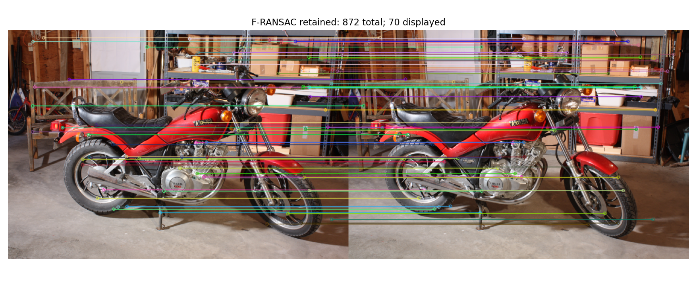

# 02｜特征匹配、几何验证与相对位姿

Day1 已经知道两台相机和每个点的对应关系。Day2 向真实图像迈一步：外观相似的位置未必是同一个三维点，相对位姿也需要估计。

本日分成两条实验链：真实摩托车图像只估计基础矩阵 $F$；合成数据已知内参 $K$，估计本质矩阵 $E$、旋转和平移方向。两条链的指标和结论需要分别解释。

## 1. 外观筛选与几何验证

真实匹配流程为：

```text
SIFT 特征 → L2 最近邻/次近邻 → ratio test → 目标点去重
         → F-RANSAC → 内点/拒绝匹配 → 极线与误差统计
```

ratio test 判断一个描述子的最佳匹配是否明显优于第二名：

$$d_1<\tau d_2.$$

实现使用严格的小于号，跳过不足两个邻居的记录，以及非有限、负距离或 $d_2\le0$ 的歧义记录。函数只筛选最佳候选，目标点去重在后续公共流程中处理。

RANSAC 回答另一个问题：一组对应点能否由同一个几何模型解释。外观筛选不能代替几何验证，几何内点也不能自动当成真实正确对应。

自己实现的 ratio test 和 Sampson 误差见 `matching_exercise.py`；完整真实流程见 `match_two_views.py`。

## 2. F、E 与坐标的关系

像素齐次坐标满足：

$$x_2^{\mathsf T}Fx_1=0.$$

对无畸变的归一化坐标 $\hat{x}_i=K_i^{-1}x_i$：

$$
\hat{x}_2^{\mathsf T}E\hat{x}_1=0,\qquad
E=K_2^{\mathsf T}FK_1.
$$

若两台相机坐标间的变换为 $X_2=R_{21}X_1+t_{21}$：

$$E=[t_{21}]_\times R_{21}.$$

因此 $F$ 作用于像素坐标，$E$ 对应归一化几何。已知 $K$ 时，可以将像素点和 $K$ 一起传给 OpenCV 的本质矩阵估计接口。

## 3. Sampson 误差与重投影误差

平方 Sampson 误差使用极线约束的一阶近似：

$$
d_S^2=
\frac{(x_2^{\mathsf T}Fx_1)^2}
{(Fx_1)_1^2+(Fx_1)_2^2+(F^{\mathsf T}x_2)_1^2+(F^{\mathsf T}x_2)_2^2}.
$$

本实验输入是像素，$d_S^2$ 的单位为 px²，报告 $\sqrt{d_S^2}$ 时单位为 px。实现先归一化 $F$ 的数值尺度；分母过小返回 `inf`，不将未定义的几何伪装成零误差。

重投影误差需要先得到三维点，再投回图像，计算预测像素与观测像素之间的距离。它和 Sampson 误差不是同一个量，本日的合成位姿结果分别保存了两者。

## 4. 真实图像：ratio 越严格越好吗


| ratio τ | ratio 后候选 | 目标去重后 | F 内点 | F 内点比例 | 内点 √Sampson 中位 (px) |
|---:|---:|---:|---:|---:|---:|
| 0.60 | 775 | 764 | 605 | 79.19% | 0.15220 |
| 0.75 | 985 | 953 | 872 | 91.50% | 0.11877 |
| 0.90 | 1327 | 1165 | 959 | 82.32% | 0.12320 |

数据见 [comparison.csv](results/Week2_Day2/outputs/real_sweep_student/comparison.csv)。F 内点比例的分母是去重后的候选数。



在这一组参数下，τ=0.75 的内点比例最高，内点误差最小；τ=0.90 的内点总数更多，但同时接受更多歧义候选。τ=0.60 也没有因为更严格就获得最高内点比例。

这组图已立体校正，因此极线和正确连线接近水平；一般照片的极线方向取决于相机几何。**91.50% 是当前模型的内点率，不是真实匹配准确率**：实验没有真实对应标签，同一极线上的重复纹理仍可能通过几何约束。内点误差也来自参与拟合并被筛选的点，不是独立测试集。

## 5. 合成数据：已知 K 下估计相对位姿

固定 seed `20261006`，生成 300 对点，其中 210 对真实正确、90 对错配。每个像素坐标加 0.5 px 标准差噪声，E-RANSAC 阈值 1 px。估计器只接收 `K、uv1、uv2`。

| 指标 | 本地结果 |
|---|---:|
| E-RANSAC 内点 | 177 |
| recoverPose 保留 | 176 |
| E 内点 precision / 正确点 recall | 0.98870 / 0.83333 |
| 旋转角误差 | 0.39842° |
| 平移方向误差 | 0.36201° |
| E 内点中的正深度比例 | 176/177 = 0.99435 |
| E 内点重投影误差中位 | 0.28866 px |
| E 内点 √Sampson 误差中位 | 0.40822 px |
| 全部真对应尺度对齐后三维误差中位 | 0.29129 m |

数据见 [metrics.json](results/Week2_Day2/outputs/pose_demo_student/metrics.json)，实验条件见 [run_config.json](results/Week2_Day2/outputs/pose_demo_student/run_config.json)。precision/recall 能计算，是因为合成数据提供了正确对应身份；真实图像分支不具备这一条件。

这里的重投影单点误差是两台相机像素欧氏距离的平均，再对 E 内点取中位数。正深度比例的分母是 E 内点 177，不能在 `recoverPose` 已经筛掉一个点后改用 176，得到一个看似完美的比例。

## 6. 平移方向、相机中心与尺度

以相机 1 为世界坐标：

$$C_2=-R_{21}^{\mathsf T}t_{21}.$$

`recoverPose` 输出 $\|t_{21}\|=1$。原始平移和三维点在“基线规范化为 1”的尺度中，不能直接写成米。GT 基线约 0.65171 m 只在评测阶段用于尺度对齐，没有传给估计器。

本日自己实现的是 ratio test 与 Sampson 误差。E-RANSAC、`recoverPose` 和三角化由已提供的 `pose_core.py` 调用 OpenCV 完成；运行入口是 `two_view_pose.py`。

## 7. 检查与实验来源

本地 [check_student.json](results/Week2_Day2/outputs/check_student.json) 记录 **18/18 通过**：练习函数 14/14，已提供代码 4/4。边界检查包括严格 ratio 阈值、空输入、F 尺度/符号不变性，以及两视图交换等。


## 8. 结论边界

本次完成了一对真实图像的 F 验证和一组含错配合成数据的相对位姿估计。τ=0.75 在这次实验中表现较好，不代表普遍最优；约 0.4° 的合成位姿误差不代表任意弱基线、重复纹理或退化场景都能成功。

选做的 0%/30% 错配和两条估计路线对照没有本地结果。两条路线同时改变求解器、参与拟合的点集和 E 约束处理，即使运行，也不能简单称为只切换 RANSAC 的单变量消融。

下一步把两视图的匹配和几何验证扩展到多图，进入 [COLMAP 稀疏重建](03_COLMAP_Sparse_Reconstruction.md)。

本页记录原实验的代码职责和结果；完整运行脚本、原始数据与大型模型未在精简仓库中分发。
