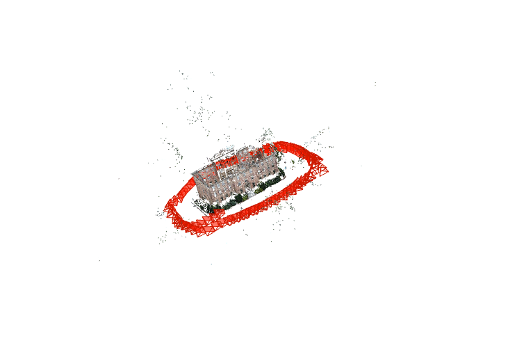
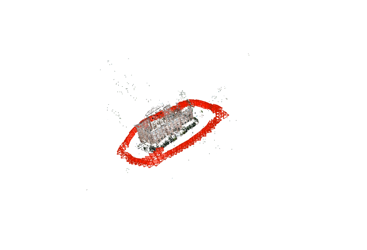

# 03｜COLMAP 多图稀疏重建

Day3 将前两天的投影、匹配和几何验证放进真实多图流程。输入是 128 张 South Building 原图，输出是相机位姿、内参和稀疏三维点。

自己实现的部分是串联 COLMAP 命令和统计模型，重建算法由 COLMAP 执行。本日完成了 4096/2048 两种特征上限的本地实验，两组都将 128 张图注册到一个模型中。

## 1. SfM 的三个阶段

```text
原图 → feature_extractor → database.db
                           ↓
                  exhaustive_matcher
                           ↓
原图 + 特征/匹配数据库 → mapper → sparse/0
                                      ↓
                     TXT 导出 / model_analyzer / 自己的统计
```

- **特征提取**：从图像提取局部特征，保存特征位置、描述子和相机初值。
- **匹配与几何验证**：搜索候选对应，检验图像对是否具有一致几何关系。
- **增量建图**：初始化可重建图像对，加入新图像、三角化新点，并使用束调整优化。

三个阶段必须共用同一个数据库。脚本用参数列表调用进程，路径保持独立字符串，不手动拼接 shell 引号。

实现见 `sfm_exercise.py`，运行入口见 `run_day3.py`。程序会探测本机 `-h`，适配当前 COLMAP 的 GPU、尺寸和线程参数名称，并保存原始命令与日志。

## 2. 注册、TRACK 与束调整

导入数据库仅表示系统读到了图像。**注册**意味着图像已经有模型内的相机位姿，并参与共同三维重建。

一个三维点的 TRACK 包含其在多幅图中的观测，记录为 `(IMAGE_ID, POINT2D_IDX)` 对。TRACK 长度是观测次数，不是时间轨迹长度。

束调整（Bundle Adjustment，BA）共同优化相机参数、位姿和三维点。其重投影目标可写成：

$$
\min_{\{R_i,t_i,K_i\},\{X_j\}}
\sum_{(i,j)\in\mathcal O}
\rho\!\left(\left\|x_{ij}-\pi(K_i,R_i,t_i,X_j)\right\|^2\right).
$$

$\mathcal O$ 是实际观测集合，$\pi$ 包含相机模型和畸变。像素残差变小表示拟合改进；没有外部真值时，不能直接把它解释为米尺度三维精度。

## 3. 模型文件与统计定义

| 文件 | 主要内容 |
|---|---|
| `cameras` | 相机模型、图像尺寸和内参 |
| `images` | 注册图像、位姿和逐图二维观测 |
| `points3D` | 三维坐标、颜色、储存的 ERROR 和 TRACK |
| `rigs` / `frames` | 当前 COLMAP 的传感器组合与帧关系 |

IMAGE_ID、POINT3D_ID 可以不连续。点数应数有效记录，不能拿最大 ID 代替。一条相机参数记录也可能被多幅图像共享。

本日 `summarize_model` 使用以下定义：

$$
\text{注册率}=\frac{\text{该子模型注册图像数}}{\text{本次实际输入清单图像数}}.
$$

平均 ERROR 对 `points3D.txt` 的逐点 ERROR 等权平均，不按 TRACK 长度加权；观测总数是 TRACK 长度之和。没有点时平均误差返回 `None`，不能写成 0。统计入口见 `summarize_run.py`。

## 4. 本地环境与控制条件

本地运行日期为 2026-10-07，使用 Windows、Python 3.11.17、COLMAP 4.2.1 CUDA，RTX 4060 Laptop GPU。两次输入相同的 128 张 3072×2304 图像，输入清单摘要相同。

| 配置 | 两组共同设置 |
|---|---|
| 相机模型 | SIMPLE_RADIAL |
| 强制共享内参 | `single_camera=false` |
| 内部图像最长边 | 1600 |
| 线程 / GPU / seed | 4 / true / 0 |
| 计划干预 | `max_num_features`：4096 → 2048 |

对照使用新的数据库和输出目录，从原图重新提取特征。两组最终各有一个 CAMERA_ID；这次输入的图像尺寸和 EXIF 焦距一致，但不能因此推广为任意同一相机拍摄的图像都必须共享内参。

## 5. 实验结果

| 指标 | base4096 | features2048 |
|---|---:|---:|
| 子模型数量 | 1 | 1 |
| 注册 / 输入 | 128 / 128 | 128 / 128 |
| 三维点数 | 40,692 | 17,817 |
| 观测总数 | 241,106 | 98,184 |
| 平均 TRACK 长度 | 5.9251 | 5.5107 |
| 平均点 ERROR (px) | 0.76347 | 0.93145 |
| 中位点 ERROR (px) | 0.62560 | 0.81623 |
| 特征提取 (s) | 8.93 | 7.98 |
| 匹配 (s) | 66.98 | 16.20 |
| 建图 (s) | 113.00 | 35.64 |

数据见 [comparison.csv](results/Week2_Day3/outputs/comparison.csv)、[base4096 summary](results/Week2_Day3/outputs/base4096/summary.json) 和 [features2048 summary](results/Week2_Day3/outputs/features2048/summary.json)。各阶段退出码均为 0，时长来自两组 `run_status.json`。





特征上限减半后，点数降至原来的约 43.8%，观测数约为 40.7%；匹配和建图更快，平均 TRACK 略短，储存残差更高，图像覆盖没有变化。截图中两组相机视锥都围绕建筑，2048 的立面更稀；周围仍可见零星离群点。

特征提取日志里的实际条数并不等于设置的上限值：4096 组每图均值约 5384.7，2048 组约 2382.5。应使用日志确认干预确实改变了提取结果，不能直接用配置值充当实际特征数量。

base4096 特征阶段曾记录 `ResizePyramid: out of memory`，随后全部 128 张图仍处理完成，阶段退出码为 0。这是已经观察到的警告；本次没有证据判断它是否改变了个别特征。

## 6. 对照能支持什么结论

`compare_runs.py` 核对图像清单、COLMAP 程序、练习代码和其他控制参数，确认计划改变的是特征上限。

不过两组各只运行一次，没有真实位姿、真实三维坐标或留出图像；GPU、多线程也不保证逐位复现。两组保留下来的点和观测集合不同，所以平均 ERROR 的变化不能单独证明哪组几何更准确。这是探索性对照，不是统计显著性检验。

本次验证的是：本机能够完成真实多图稀疏 SfM，全部输入进入同一可辨认建筑模型；特征配置影响点密度、观测和运行时间。尚未验证米尺度、重力方向、离群点成因及真值精度。

## 7. 检查与实验来源

本地 [check_all.json](results/Week2_Day3/outputs/check_all.json) 记录 **15/15 通过**，检查命令构造和统计接口。单元检查不调用 COLMAP，也不替代真实重建质量检查。

先在 `Week2_Day3/configs/day3.json` 中填写自己的 COLMAP 安装位置，并从 [官方数据入口](https://demuc.de/colmap/datasets/) 下载 South Building ZIP。原图和大型数据库未作为学习笔记上传。

以下入口名称用于追溯本地实验，完整脚本未收录于本笔记仓库。


Day3 拒绝复用已存在的 run_name，避免旧特征缓存污染新对照。`doctor` 只验证启动和帮助接口；GPU 是否真正工作要看实际特征/匹配日志。

下一天将解析模型中的相机与观测，重新计算投影，而不只读取已存储的 ERROR。后续实验需要同一份 base4096 模型；使用本地已有模型或先完成本节复现，并保持不同重建的坐标系分开。

本页记录原实验的代码职责和结果；完整运行脚本、原始数据与大型模型未在精简仓库中分发。
