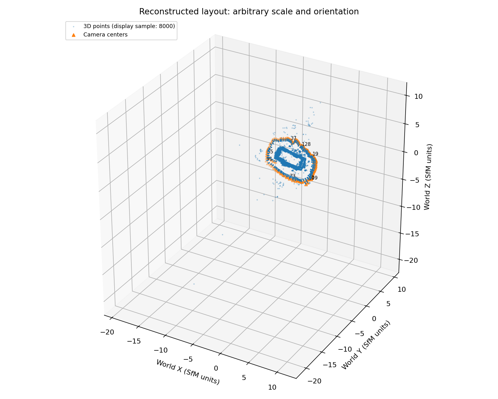
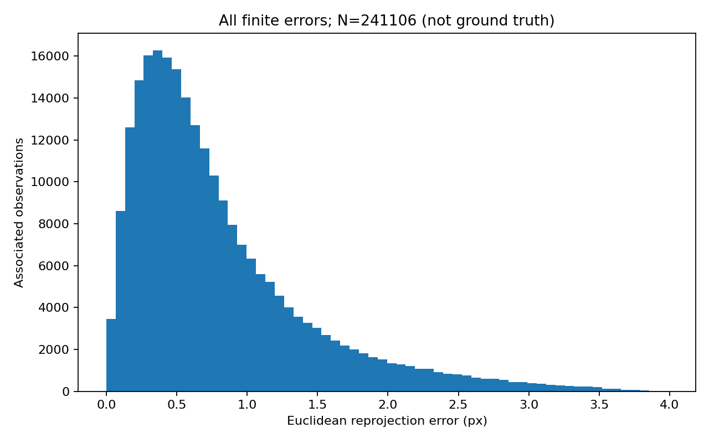

# 04｜相机位姿与重投影：把 COLMAP 模型读回图像

[返回总览](README.md) · [上一节：COLMAP 重建](03_COLMAP_Sparse_Reconstruction.md) · [下一节：RGB-D 反投影](05_RGBD_Backprojection.md)

Day3 得到了稀疏模型，Day4 要回答的是：文件中的旋转和平移怎样把世界点投回原图？如果矩阵方向或者畸变处理错了，残差会怎样变化？本节使用同一次 `base4096` 重建，重新计算全部 Track 关联观测的像素误差。

## 1. 从文件到坐标系

`cameras.txt` 保存相机模型及参数；`images.txt` 保存图像的位姿和二维观测；`points3D.txt` 保存三维点及其 Track。ID 是标识符，不能直接当作数组下标。二维观测中的 `POINT3D_ID=-1` 表示没有关联三维点，需要保留它原来的 `POINT2D_IDX`。

本次模型有 1 条相机参数记录、128 张注册图像、40,692 个三维点，以及 241,106 条关联观测。相机模型是 `SIMPLE_RADIAL`，参数顺序为 $[f,c_x,c_y,k]$。模型选择规则是注册图像最多；这个规则并没有评价几何准确性。

COLMAP 图像位姿是 **world-to-camera**，四元数使用 Hamilton 的 $[w,x,y,z]$ 顺序：

$$
\mathbf X_c=\mathbf R\mathbf X_w+\mathbf t.
$$

相机中心不是 $\mathbf t$，而是：

$$
\mathbf C=-\mathbf R^\mathsf T\mathbf t,\qquad
\mathbf T_{w\leftarrow c}=
\begin{bmatrix}\mathbf R^\mathsf T&-\mathbf R^\mathsf T\mathbf t\\0&1\end{bmatrix}.
$$

相机局部轴为右、下、前。SfM 世界的尺度仍是任意的，不能把图中的长度直接解释为米。图像 ID 排序也不等于拍摄时间轨迹。



## 2. SIMPLE_RADIAL 投影

先除轴向深度，再计算归一化平面上的畸变，最后乘内参：

$$
x=X_c/Z_c,\quad y=Y_c/Z_c,\quad r^2=x^2+y^2,
$$

$$
u=f(1+kr^2)x+c_x,\qquad v=f(1+kr^2)y+c_y.
$$

实现保留每个输入点的位置；无效行返回 `NaN`，有限正深度但投影到图像外的点仍保留。投影数学有效和位于图像范围内是两个判断。本次 observed/predicted 像素使用同一 COLMAP 坐标约定，没有只对其中一方加减 0.5。

`pose_exercise.py` 实现了四元数转旋转、位姿求逆和径向投影。以 `(N, 3)` 行向量保存点时，列向量公式在 NumPy 中写成：

```python
points_camera = points_world @ R.T + t
camera_center = -R.T @ t
```

`model_io.py` 负责文本解析和双向 Track 核对；`evaluate_model.py` 负责在原有观测上计算残差，没有重新优化模型。`day4_check.py` 的历史全组结果为 20/20，覆盖旋转、位姿、投影和格式边界。

## 3. 两种误差聚合不能混用

对观测 $j$，像素误差为 $e_j=\|\hat{\mathbf u}_j-\mathbf u_j\|_2$。将所有观测等权平均，会给长 Track 更高权重。先在每个三维点的 Track 内平均，再对三维点等权平均，则每个三维点权重相同。

| 指标 | 本次值 | 分母及聚合 |
|---|---:|---|
| 有效关联观测 | 241,106 / 241,106 | 全部原有 Track 观测 |
| 像素误差均值 | 0.800141 px | 观测等权 |
| 像素误差中位数 | 0.614936 px | 观测等权 |
| 像素误差 P95 | 2.162376 px | 观测等权 |
| 像素误差 RMS | 1.024330 px | 观测等权 |
| 逐点 Track 均值再平均 | 0.763474 px | 40,692 点等权 |
| 重算逐点值与 stored ERROR 的平均绝对差 | $1.10\times10^{-13}$ px | 相同完整 Track 点 |
| 自写投影与 OpenCV 最大差 | $9.37\times10^{-13}$ px | 241,106 观测 |

证据：[重投影指标](results/Week2_Day4/outputs/reproject/metrics.json)、[模型清单](results/Week2_Day4/outputs/inventory/inventory.json)、[历史检查结果](results/Week2_Day4/outputs/checks/all_latest.json)。数值是已有本地运行的归档结果。



## 4. 故意改错一个因素

对照固定同一模型、原始观测和图像，不运行 BA。共同有效集合用来保证比较的观测身份一致，同时单独报告有效率。

| 条件 | 原观测有效率 | 与 baseline 共同有效数 | baseline 在公共集合的中位数 | 条件在公共集合的中位数 |
|---|---:|---:|---:|---:|
| baseline | 1.000 | 241,106 | 0.614936 px | 0.614936 px |
| 忽略畸变，即 $k=0$ | 1.000 | 241,106 | 0.614936 px | 2.054873 px |
| 把 c2w 当作 w2c | 0.524578 | 126,479 | 0.583236 px | 1385.371503 px |

证据：[诊断对照](results/Week2_Day4/outputs/controls/comparison.json)。忽略畸变使配对误差增量均值达到 2.294833 px。用反位姿既改变残差，也使约一半观测不再满足正深度条件，因此不能只比较两个条件各自的全体中位数。

本次支持“文件读取、坐标方向和投影实现与模型约定一致”。它没有验证外部三维真值，也没有验证留出视角；同一模型原有 Track 的小残差可以与错误尺度或者其他几何偏差同时存在。

## 5. 实验入口（本地记录）

在 `Week2_Day4` 中运行。先完成 Day3 并使 `configs/day4.json` 的 `day3_run` 指向实际重建目录；移动数据后显式设置 `image_root`。模型、原图和输入哈希清单均来自 Day3。


已有输出不会覆盖；重跑实验使用 `--out outputs/reproject_v2` 等新目录。阅读依据：[COLMAP 格式](https://colmap.github.io/format.html)、[COLMAP 4.2.1 相机模型源码](https://github.com/colmap/colmap/blob/4.2.1/src/colmap/sensor/models.h)、[stored ERROR 计算源码](https://github.com/colmap/colmap/blob/4.2.1/src/colmap/scene/reconstruction.cc)。

本页记录原实验的代码职责和结果；完整运行脚本、原始数据与大型模型未在精简仓库中分发。
