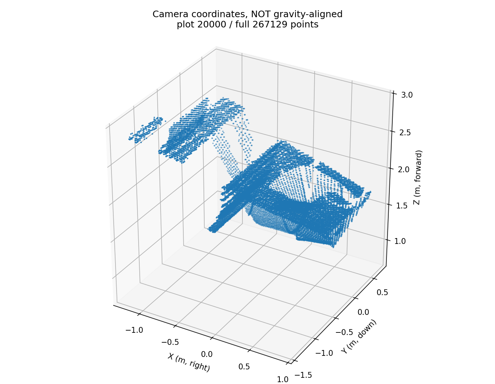

# 05｜RGB-D 反投影：深度、距离和像素身份

[返回总览](README.md) · [上一节：相机位姿](04_Camera_Pose_and_Reprojection.md) · [下一节：多帧融合](06_MultiFrame_RGBD_Fusion.md)

多视图三角化需要从多个观测估计深度；RGB-D 输入已经给出深度。Day5 的核心是把一张 RGB 图、对应的轴向深度和内参变成相机坐标系点云，并保留每个点来自哪个像素。此处使用 Open3D 的 Redwood 第 0 帧，与 South Building 的 SfM 模型没有做坐标对齐。

## 1. 深度单位与有效集合

输入为 640×480，深度存储类型为 `uint16`。原值先按配置比例转换为 `float32` 米：

$$
Z=\frac{D_{raw}}{depth\_scale}.
$$

本次 `depth_scale=1000`，`depth_trunc_m=3`，有效条件为 $0<Z<3$；零、负值、非有限值及达到截断边界的值置零。这一严格边界对应 Open3D 0.19.0 的转换行为。

`RGBDImage` 内部深度已是米，后续创建点云时不能再次除以 1000。截断阈值约束的是轴向深度，不是三维点到相机中心的距离。

## 2. 针孔反投影

对于整数列、行 $(u,v)$，使用原内参 JSON 读取的 $f_x,f_y,c_x,c_y$：

$$
\mathbf X_c=Z\begin{bmatrix}(u-c_x)/f_x\\(v-c_y)/f_y\\1\end{bmatrix}.
$$

这里的向量不能先单位化，因为 $Z$ 是相机前向轴上的分量。离光轴越远，点到相机的欧氏距离与 $Z$ 的差别越大：

$$
s=\|\mathbf X_c\|_2=Z\sqrt{1+((u-c_x)/f_x)^2+((v-c_y)/f_y)^2}.
$$

`rgbd_exercise.py` 将反投影先保存为 `(H, W, 3)` 的组织点云，无效像素填 `NaN`，再一起筛选 XYZ、RGB 和原始像素 ID：

```python
valid = np.isfinite(xyz_map).all(axis=2) & (xyz_map[:, :, 2] > 0)
points = xyz_map.reshape(-1, 3)[valid.reshape(-1)]
colors = rgb.reshape(-1, 3)[valid.reshape(-1)].astype(float) / 255.0
pixel_ids = np.flatnonzero(valid.reshape(-1))  # pixel_id = v * W + u
```

内参 JSON 的 9 个元素使用列主序恢复矩阵。点与颜色共用同一掩码和行主序身份，避免出现“形状正确但颜色错位”的问题。



## 3. 与 Open3D 按同像素对照

实验固定原 RGB、原始深度、K、scale、截断和单位外参。NumPy 与 Open3D 输出使用原始 `pixel_id` 对齐，没有最近邻匹配或配准。

| 指标 | 本次值 |
|---|---:|
| 输入像素数 | 307,200 |
| 有效像素数 | 267,129 |
| 有效比例 | 0.869561 |
| 轴向深度中位数 | 1.861000 m |
| 到相机距离中位数 | 1.956611 m |
| NumPy / Open3D 共同像素 | 267,129 |
| 有效掩码不一致数 | 0 |
| 同像素 XYZ 最大差 | 0 m |
| 同像素 RGB 最大通道差 | 0 |
| 同相机像素往返最大差 | $6.57\times10^{-14}$ px |

证据：[反投影指标](results/Week2_Day5/outputs/backproject/metrics.json)、[实现对照](results/Week2_Day5/outputs/compare/implementation_comparison.json)。`day5_check.py` 的历史结果为 [20/20](results/Week2_Day5/outputs/check_all_todo/check_report.json)。

实现完全一致说明这两条计算路径在相同前提下得到相同结果。它没有提供独立深度真值；若输入深度比例错误，两条路径也可以一起错误。

## 4. Scale 与截断改变了什么

固定原始数据和 K，只改变比例或阈值。三个条件共有 84,025 个有效像素；几何变化在该公共集合上计算，覆盖数量单独统计。

| 条件 | 全体有效点数 | 公共集合 Z 中位数 | 公共集合相对 baseline 的三维变化中位数 |
|---|---:|---:|---:|
| scale=1000，截断 3 m | 267,129 | 1.254000 m | 0 m |
| scale=500，截断 3 m | 84,025 | 2.508000 m | 1.362576 m |
| scale=1000，截断 2 m | 175,472 | 1.254000 m | 0 m |

证据：[控制实验 JSON](results/Week2_Day5/outputs/controls/comparison.json)、[CSV 表](results/Week2_Day5/outputs/controls/comparison.csv)。

把 scale 减半会把同像素深度和坐标放大到两倍；固定 3 m 截断还会删掉更多像素，所以它同时改变几何和支持集合。改截断不会移动仍然有效的点，但会改变点数和全体统计分布。

三个条件在公共像素上回投误差仍约 $10^{-14}$ px。这是因为沿原射线缩放三维点会保持 $X/Z$、$Y/Z$，因此同相机往返无法证明深度单位正确。这里报告的三维变化是条件差异，不能称为对真值的重建误差。

## 5. 复现与数据来源

源码入口是 `prepare_data.py` 和 `rgbd_to_cloud.py`。在 `Week2_Day5` 中运行：


准备脚本从 [Open3D 官方归档](https://github.com/isl-org/open3d_downloads/releases/download/20220301-data/SampleRedwoodRGBDImages.zip) 获取原始数据，验证 MD5 并为输入保存 SHA256；不会把归档中的现成 TSDF 点云当作学习成果。原始数据没有随本仓库分发；权利与再分发条件仍以 Open3D / Redwood 来源声明为准。

已有输出不能覆盖，重跑加 `--out outputs/compare_v2` 等。参考：[Open3D 0.19.0 RGB-D 教程](https://www.open3d.org/docs/0.19.0/tutorial/geometry/rgbd_image.html#redwood-dataset)、[点云工厂接口](https://www.open3d.org/docs/0.19.0/python_api/open3d.geometry.PointCloud.html#open3d.geometry.PointCloud.create_from_rgbd_image)。

本页记录原实验的代码职责和结果；完整运行脚本、原始数据与大型模型未在精简仓库中分发。
