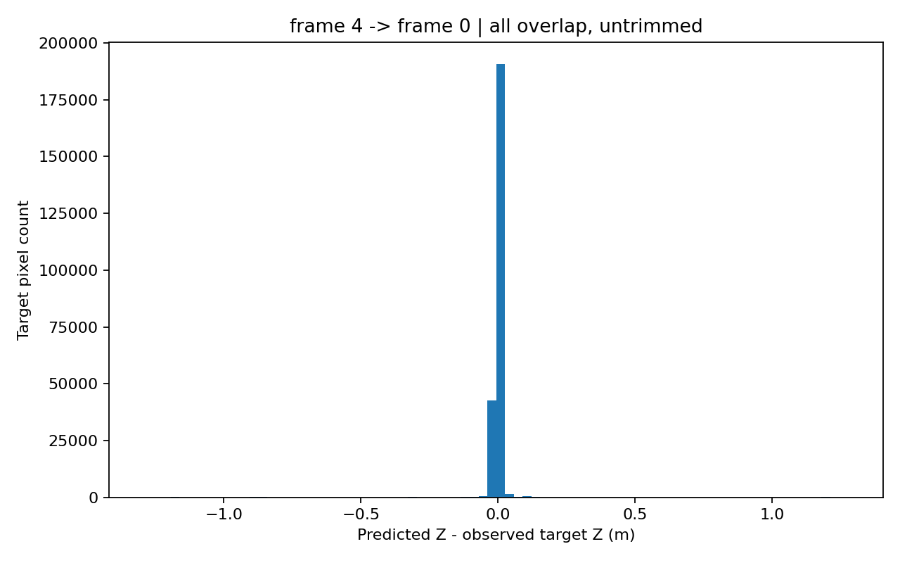
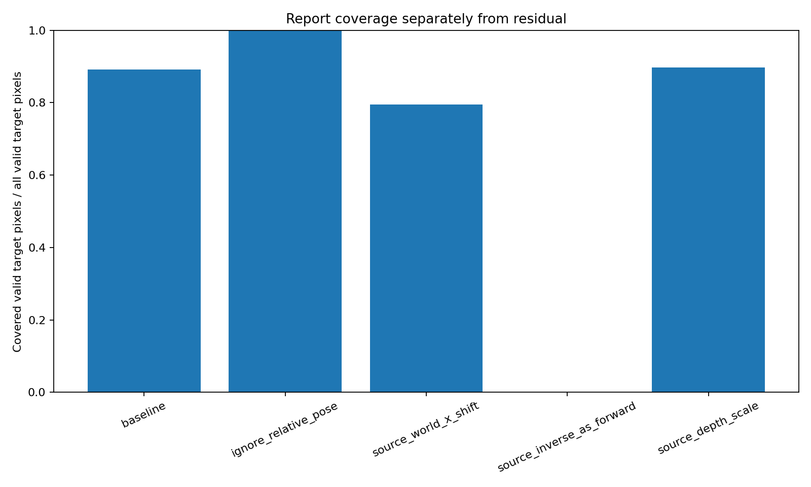

# 06｜多帧 RGB-D：给定位姿合并与跨帧检查

[返回总览](README.md) · [上一节：RGB-D 反投影](05_RGBD_Backprojection.md) · [下一节：世界射线接口](07_Ray_Interface_and_NeRF_Bridge.md)

Day5 的点位于各自的相机坐标系。Day6 使用同一份 Redwood 数据的五帧及给定 `odometry.log` 轨迹，将这些点变到一个世界坐标系，然后检验源帧投到目标帧后的深度一致性。位姿是输入；本节没有重新估计轨迹、ICP、SLAM 或 BA。

## 1. 变换方向写在名称中

设 $\mathbf T_{w\leftarrow c}$ 将相机列向量变到世界，公式为：

$$
\mathbf X_w=\mathbf R_{w\leftarrow c}\mathbf X_c+\mathbf t_{w\leftarrow c}.
$$

刚体逆和两相机的相对变换为：

$$
\mathbf T^{-1}=\begin{bmatrix}\mathbf R^\mathsf T&-\mathbf R^\mathsf T\mathbf t\\0&1\end{bmatrix},
\qquad
\mathbf T_{t\leftarrow s}=\mathbf T_{w\leftarrow t}^{-1}\mathbf T_{w\leftarrow s}.
$$

`fusion_exercise.py` 的核心实现是：

```python
points_world = points_camera @ R.T + t
T_target_from_source = invert_se3(T_world_from_target) @ T_world_from_source
```

原 LOG 文本矩阵为 camera-to-world；Open3D 的 LOG loader 把其逆保存在 `extrinsic` 中。加载后的 API 外参与原文件矩阵方向相反，不能在两种读法之间直接替换变量。输入原点和旋转保持原样，没有为了画图重新定义世界。

## 2. 拼点、体素和 TSDF 是三个步骤

五帧独立反投影、变换后拼接得到 1,340,711 个点。原始结果保留 `frame_id + pixel_id`，可回到同一个源像素做对照。0.02 m 体素降采样得到 28,218 个点，用于较轻的表示与显示；其顶点不再保留唯一原始像素身份。


选做 TSDF 同样使用这五帧和给定位姿，voxel=0.02 m、SDF 截断=0.06 m，生成 18,776 顶点和 33,498 三角形。TSDF 对体积维护截断符号距离，与拼接点列表不同。平滑网格的外观不能代替外部精度测量。

证据：[融合指标](results/Week2_Day6/outputs/fuse/metrics.json)、[TSDF 指标](results/Week2_Day6/outputs/tsdf/tsdf_summary.json)。`day6_check.py` 的历史全组检查为 [22/22](results/Week2_Day6/outputs/check_all/check_results.json)。

## 3. 跨帧深度残差与覆盖率一起看

源帧点经相对变换投到目标相机；投影取最近目标像素，同一目标像素的多个候选通过前向 Z-buffer 选最近深度。与目标有效深度取交集后，计算：

$$
\Delta Z=Z_{s\rightarrow t}-Z_t,\qquad
coverage=\frac{N_{overlap}}{N_{target\ valid}}.
$$

0.03 m 阈值只用于计数，没有按残差剪掉点。

| 方向 | 重叠像素 | 目标有效像素 | 覆盖率 | $|\Delta Z|$ 中位数 | P95 |
|---|---:|---:|---:|---:|---:|
| 4→0 | 238,345 | 267,129 | 0.892247 | 0.005479 m | 0.020958 m |
| 0→4 | 238,623 | 269,051 | 0.886906 | 0.005365 m | 0.020078 m |

4→0 有 233,186 个重叠像素处于 0.03 m 内，Z-buffer 去掉 24,842 次投影碰撞。[双向指标](results/Week2_Day6/outputs/pair_check/pair_summary.json) 保存完整计数和残差。



这是投影深度的一致性检查。离散投影、遮挡、边缘、深度噪声和位姿误差都可贡献残差；共同目标像素也不等于已知真实对应点，因此不能把 5.48 mm 称为全场景三维精度。

## 4. 错误对照要选择可比的集合

本次干预固定原始像素集合和目标帧深度，不运行任何重新优化。各条件有不同可见范围；以下误差表使用“该条件与 baseline 均有效的目标像素”，每一行的 baseline 都重新在同一集合上计算。

| 条件 | 各自覆盖率 | 与 baseline 公共目标数 | 条件残差中位数 | 同集合 baseline 中位数 |
|---|---:|---:|---:|---:|
| baseline | 0.892247 | 238,345 | 0.005479 m | 0.005479 m |
| 忽略相对位姿 | 0.999697 | 238,327 | 0.036000 m | 0.005479 m |
| 源帧世界 X 平移 0.1 m | 0.795537 | 201,404 | 0.034792 m | 0.005561 m |
| 源帧逆矩阵误作 c2w | 0 | 0 | 无定义 | 无定义 |
| 源帧有效深度乘 1.05 | 0.896859 | 228,409 | 0.095705 m | 0.005473 m |

证据：[对照 JSON](results/Week2_Day6/outputs/controls/comparison.json)、[对照 CSV](results/Week2_Day6/outputs/controls/comparison.csv)。



图中显示覆盖率；残差以表格和 JSON/CSV 为准。

忽略相对位姿反而提高覆盖率，因为点云被错误地叠到了目标相机。这说明覆盖多并不代表几何更好。误用逆矩阵时没有重叠，JSON 的统计是 `null`，不能读成零误差。因为这一条件的支持集合为空，全部五条件的公共交集也是空；成对公共集合才提供本次可用的比较。

同一个目标像素在不同条件下还可能由不同源点赢得 Z-buffer，因此成对像素比较仍附带可见性和采样的限制。

## 5. LOG 舍入造成的微小往返差

逐帧点变换与 Open3D 的最大差不超过 $7.69\times10^{-16}$ m，但非零帧的刚体转置逆与一般矩阵逆有约 $10^{-6}$ 差别。原因是 LOG 的打印旋转并非严格正交。例如 frame1 的逆矩阵最大差约 $1.86\times10^{-6}$，自身相机三维往返均值约 $1.62\times10^{-6}$ m。

本次没有正交化原矩阵，也没有通过重估位姿隐藏该差异。它解释了数值行为，仍不能说明真实轨迹物理误差。

## 6. 实验入口（本地记录）

在 `Week2_Day6` 中运行，`configs/day6.json` 的 `day5_root` 指向已准备数据且包含完成反投影代码的 Day5。入口为 `fuse_rgbd.py`，给定轨迹解析与身份核对在 `fusion_io.py`。


重跑使用新的 `--out` 目录。原始数据和完整点云未随本仓库上传。阅读依据：[Open3D 0.19.0 RGB-D integration](https://www.open3d.org/docs/0.19.0/tutorial/pipelines/rgbd_integration.html)、[LOG loader 源码](https://github.com/isl-org/Open3D/blob/v0.19.0/cpp/open3d/io/file_format/FileLOG.cpp)、[ScalableTSDFVolume 接口](https://www.open3d.org/docs/0.19.0/python_api/open3d.pipelines.integration.ScalableTSDFVolume.html)。

本页记录原实验的代码职责和结果；完整运行脚本、原始数据与大型模型未在精简仓库中分发。
