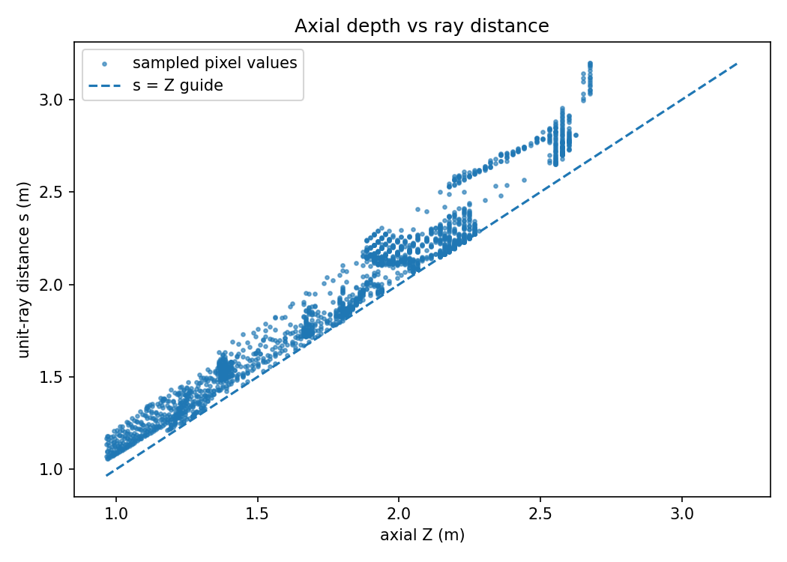
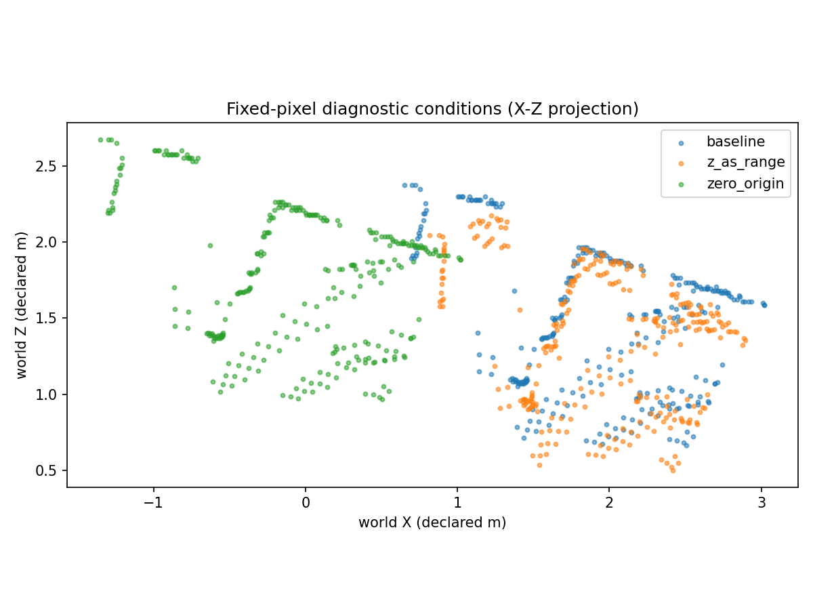

# 07｜从像素到世界射线：连接 NeRF 前先固定几何接口

[返回总览](README.md) · [上一节：多帧 RGB-D](06_MultiFrame_RGBD_Fusion.md)

第二周从投影、匹配、三角化和 SfM 走到 RGB-D 几何。Day7 将这些约定收束为“像素 → 世界射线”接口，独立检查深度反投影、世界点投影和射线构造，再与保存的 Day6 同像素点比较。此处没有训练 NeRF，也没有把单帧诊断样本当作完整训练数据集。

## 1. 本次接口契约

| 项目 | 本次约定 |
|---|---|
| 输入帧 | Redwood frame0，640×480 |
| 内参 | $f_x=f_y=525$，$(c_x,c_y)=(319.5,239.5)$ |
| 位姿 | camera-to-world，列向量公式 |
| 相机中心 | $(2,2,-0.3)$，沿用原 `odometry.log` 世界 |
| 相机局部轴 | +X 右、+Y 下、+Z 前 |
| 像素 | 原图整数列 u、行 v，不隐式加 0.5 |
| 相机模型 | RGB-D 针孔假设；没有 SIMPLE_RADIAL 畸变 |
| 深度 | 正相机 Z，按保存的 scale=1000 换算为米 |
| 射线 | 世界单位方向；参数 s 是沿射线的欧氏距离 |

SfM 的任意世界与本次 RGB-D 世界没有对齐。Day6 给定位姿也没有被外部设备认证为真值。

## 2. 单位射线与轴向深度

先由像素构造未单位化的相机平面向量：

$$
\mathbf q_c=\begin{bmatrix}(u-c_x)/f_x\\(v-c_y)/f_y\\1\end{bmatrix},\quad
\mathbf q_w=\mathbf R_{w\leftarrow c}\mathbf q_c.
$$

射线原点是相机中心，方向仅受旋转影响：

$$
\mathbf o=\mathbf t_{w\leftarrow c},\quad
\mathbf d=\frac{\mathbf q_w}{\|\mathbf q_w\|_2},\quad
\mathbf r(s)=\mathbf o+s\mathbf d.
$$

要使射线端点等于轴向深度的反投影结果，必须使用：

$$
s=Z\|\mathbf q_w\|_2=Z\cdot z\_to\_range.
$$

`geometry_audit_exercise.py` 对 `(N, 2)` 像素数组的实现为：

```python
q_world = camera_plane(uv, K) @ R.T
z_to_range = np.linalg.norm(q_world, axis=1)
directions = q_world / z_to_range[:, None]
origins = np.repeat(t[None, :], len(uv), axis=0)
endpoints = origins + (z_depth * z_to_range)[:, None] * directions
```

单位化的是旋转后的世界方向；原 LOG 旋转存在打印舍入时，不先强制正交化，也不假定相机方向和世界方向的范数完全相等。深度反投影保留 $Z\mathbf q_c$，不能直接用 $Z$ 乘单位方向。



## 3. 独立检查与真实输入自洽是两种证据

`day7_check.py` 的历史全组结果为 [24/24](results/Week2_Day7/outputs/check_all/check_report.json)，其中 21 项数值测试、3 项输入 guard。测试覆盖非平凡旋转和平移、负世界 Z、无效相机深度、空数组、输入顺序、不加半像素、单位方向和舍入旋转。

真实输入的实验从 267,129 个有效深度像素中确定性抽取 2,048 个，按同一 `frame_id + pixel_id` 与 Day6 保存点对齐。它是诊断抽样，没有建立训练/验证/测试划分。

| 指标 | 本次值 | 集合 |
|---|---:|---|
| 单位方向范数最大偏差 | $2.22\times10^{-16}$ | 2,048 射线 |
| z_to_range 中位数 / 最大值 | 1.074243 / 1.218169 | 2,048 像素 |
| 独立反投影与保存 Day6 点最大距离 | $6.28\times10^{-16}$ m | 同 frame、pixel |
| 射线端点与反投影最大距离 | $6.28\times10^{-16}$ m | 同 frame、pixel |
| 同相机有效回投 | 2,048 / 2,048 | 原样本 |
| 像素往返中位数 | $2.84\times10^{-14}$ px | 有效回投 |

证据：[射线指标](results/Week2_Day7/outputs/rays/metrics.json)。独立合成测试验证实现是否满足已知几何；真实输入比较验证同一 K、深度和位姿下的接口一致性。二者均没有测量外部物理精度。

## 4. 两个错误暴露了不同问题

对照固定 2,048 个像素、K 和单位方向，只改变射线距离或者原点。

| 条件 | 到 baseline 反投影的三维变化中位数 | 有效回投 | 公共集合像素残差中位数 |
|---|---:|---:|---:|
| baseline：$s=Z\cdot z\_to\_range$ | 0 m | 2,048 | $2.84\times10^{-14}$ px |
| z_as_range：直接令 $s=Z$ | 0.123180 m | 2,048 | $5.68\times10^{-14}$ px |
| zero_origin：把原点改成世界零点 | 2.844293 m | 2,048 | 692.449631 px |

三条件公共有效集合也是 2,048。证据：[JSON](results/Week2_Day7/outputs/controls/comparison.json)、[CSV](results/Week2_Day7/outputs/controls/comparison.csv)。



`z_as_range` 使点沿原射线向相机靠近，因此三维位置改变，但同相机像素投影几乎不变。它再次说明像素往返自洽无法验明射线距离或深度尺度。

`zero_origin` 把每个端点平移了一个相机中心的负向量，变化长度 $\|(2,2,-0.3)\|=2.844293$ m。只改射线原点不等于完整地重定义世界坐标；本次仍有全部正深度，也不能据此认定几何未变。

## 5. NeRF 下一步需要什么

目前可提供图像、K、camera-to-world、相机轴及单位世界射线。射线本身不需要深度；有效深度像素只是本周的诊断采样便利。

进入体渲染前，需要独立确定全部视角、训练/验证/测试划分、分辨率与 K 的同步、畸变处理，以及 near/far 和采样参数。对于本节单位方向，near/far 的单位应沿 s 的距离；轴向 Z 需先转换。原始 NeRF 实现使用不同的局部轴符号和非单位方向，移植时应先转换约定，再讨论渲染结果。

本周相机残差、深度往返和共享输入 API 对照不能代替新视角评测。`ray_interface.npz` 是单帧诊断接口，不包含完整训练划分，也不是完整动态世界模型。

## 6. 实验入口（本地记录）

在 `Week2_Day7` 中运行。`ray_bridge.py` 读取已完成 Day6 fuse 输出，并验证原始 RGB-D、内参、LOG 和 manifest 的哈希；完整点云须由本机 Day6 重新生成。移动数据时设置 `configs/day7.json` 的 `data_root`；`day6_fuse_run` 必须指向实际成功的 fuse 目录。


证据索引配置应指向自己的实际输出路径。重复运行选择新的 `--out`，更改检查输出后相应设置 `--check-report`。阅读：[NeRF 作者项目页](https://www.matthewtancik.com/nerf)、[作者射线函数](https://github.com/bmild/nerf/blob/master/run_nerf_helpers.py)、[体渲染中的方向范数](https://github.com/bmild/nerf/blob/master/run_nerf.py)。

本页记录原实验的代码职责和结果；完整运行脚本、原始数据与大型模型未在精简仓库中分发。
