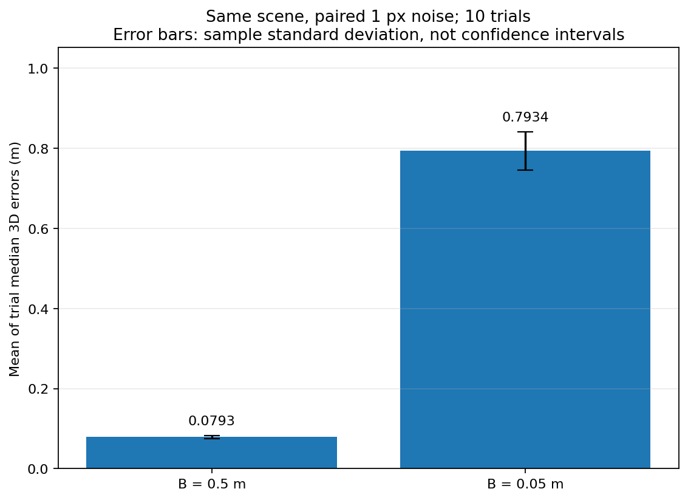
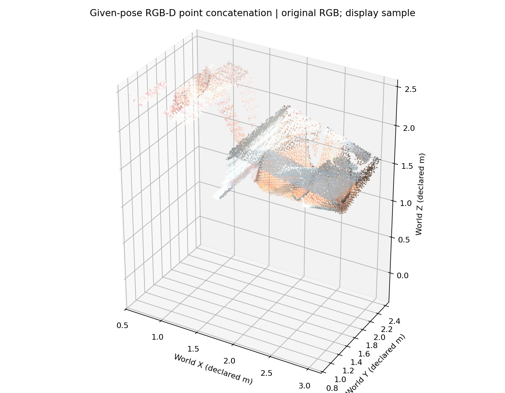

# WM Week 2 — Multi-View Geometry

World Model 学习路线第二周：从两视图三角化、匹配和 COLMAP 稀疏重建，到 RGB-D 反投影、多帧几何检查与世界射线接口。实验数字来自本地七天学习记录，证据收录于 `results/`。本周完成几何基础实验，尚未训练 NeRF 或生成式世界模型。

**Detail docs:** [01 Two-View Triangulation](01_Two_View_Triangulation.md) · [02 Matching / Relative Pose](02_Matching_and_Relative_Pose.md) · [03 COLMAP Sparse Reconstruction](03_COLMAP_Sparse_Reconstruction.md) · [04 Camera Pose / Reprojection](04_Camera_Pose_and_Reprojection.md) · [05 RGB-D Backprojection](05_RGBD_Backprojection.md) · [06 Multi-Frame Fusion](06_MultiFrame_RGBD_Fusion.md) · [07 Ray Interface / NeRF Bridge](07_Ray_Interface_and_NeRF_Bridge.md)

[Source Index](SOURCE_INDEX.md) · [Checks](results/PACKAGE_CHECKS.md)

---

## 1. Goal

- 用已知相机和合成真值理解 DLT、SVD、基线与像素噪声怎样影响三维恢复。
- 区分外观匹配、几何内点、相对位姿估计和多视图 SfM。
- 从实际 COLMAP 模型读取相机、位姿和 Track，重算投影并检查坐标约定。
- 把原始 RGB-D 变成带像素身份的点，再按给定位姿合并并检查跨帧深度。
- 将像素、内参和 camera-to-world 转成明确的世界射线，为下一周 NeRF 做准备。

## 2. Problem Formulation

相机投影使用 world-to-camera：

$$X_c=R_{cw}X_w+t_{cw},\qquad \lambda\tilde p=KX_c,$$

相机中心与逆变换为：

$$C_w=-R_{cw}^{\mathsf T}t_{cw},\qquad X_w=R_{cw}^{\mathsf T}(X_c-t_{cw}).$$

针孔 RGB-D 反投影先把原始深度换成轴向米制深度 $Z$：

$$X_c=ZK^{-1}[u,v,1]^{\mathsf T}.$$

对 camera-to-world 的旋转 $R_{wc}$ 和相机中心 $C_w$，令 $q_w=R_{wc}K^{-1}[u,v,1]^{\mathsf T}$，则单位世界射线为：

$$r(s)=C_w+s\frac{q_w}{\|q_w\|},\qquad s=Z\|q_w\|.$$

| 对象 | 本周约定 |
|---|---|
| 像素 | u 为列、v 为行；栅格索引用整数，匹配 / Track 可为亚像素；Day7 不额外加 0.5 |
| 相机局部轴 | 右 / 下 / 前 |
| COLMAP 位姿 | world-to-camera；SfM 世界尺度任意 |
| Redwood LOG 位姿 | 给定 camera-to-world；深度换算单位为米 |
| $Z$ | 相机轴向深度 |
| $s$ | 沿单位射线的距离；一般不等于 $Z$ |

South Building 与 Redwood 是不同场景。它们的坐标系和尺度没有在本周对齐。

## 3. Pipeline / Architecture

```text
RGB / SfM
Day1 known cameras + known correspondences → DLT triangulation
Day2 SIFT → ratio test → F/E RANSAC → synthetic R / translation direction
Day3 feature extraction → matching → mapper → triangulation / BA → sparse model
Day4 camera / pose / track parsing → full-track reprojection → diagnostic controls

RGB-D / given poses
Day5 raw RGB + depth + K → metric axial depth → camera-frame points
Day6 given LOG poses → world-frame clouds → voxel sampling / depth checks / TSDF
Day7 pixel + K + camera-to-world → unit world rays → Z vs range controls
```

Day2 和 Day3 包含位姿估计；Day6 使用给定轨迹。本周没有实现完整 SLAM，也没有网络训练。代码职责和跨天依赖见各专题正文；完整运行代码未收录于本笔记仓库。

## 4. Experiments

历史运行环境为 Windows、Python 3.11.17、NumPy 2.3.5、OpenCV 4.13.0、Open3D 0.19.0、COLMAP 4.2.1；不同日的记录以各自保存的 environment/config 为准。

| 实验 | 固定条件与指标 | 本地观察 |
|---|---|---|
| Day1 基线 / 噪声 | 300 个合成点，1 px 噪声；10 次重复，报告各次三维中位数的均值 | 0.5 m 基线：0.0793 m；0.05 m 基线：0.7934 m；两组重投影约 0.4854 px |
| Day2 真实匹配 | Motorcycle，ratio 0.75，F 几何验证 | 唯一候选 953，内点 872，比例 0.9150；真实匹配准确率未知 |
| Day2 合成相对位姿 | 已知 K，300 对观测，210 对真实匹配 | 旋转误差 0.398°，平移方向误差 0.362°；恢复平移范数为 1 |
| Day3 稀疏重建 | South Building，base4096，单个子模型 | 注册 128/128；40,692 点；241,106 观测；存储 ERROR 按点均值 0.7635 px |
| Day4 全 Track 重投影 | 同一个 base4096；241,106 有效观测 | 观测中位数 0.6149 px、均值 0.8001 px；忽略畸变后中位数 2.0549 px |
| Day5 同像素 API 对照 | 第 0 帧，scale 1000，截断 3 m | 267,129 有效像素；NumPy / Open3D 三维差为 0，掩码不一致数为 0 |
| Day6 给定位姿融合 | 五帧；体素 0.02 m；4→0 深度检查 | 1,340,711 原始点 → 28,218 体素点；覆盖率 0.8922；重叠绝对深度残差中位数 0.00548 m |
| Day7 射线诊断 | 第 0 帧，2048 个固定像素 | 正确端点与反投影一致；把 Z 当 range，三维差中位数 0.1232 m，同相机像素残差仍接近零 |

各指标的分母、聚合方式和公共集合详见对应专题与 [SOURCE_INDEX](SOURCE_INDEX.md)。这些实验使用不同数据和指标，不能据此对方法做统一性能排名。





## 5. Findings

1. 小重投影误差不足以证明三维准确：短基线会放大深度不确定性，沿同一射线改变距离也可能不改变原像素。
2. 几何内点率描述模型筛选结果。没有真实标签时，它不能被称为匹配准确率；恢复出的单位平移方向也没有米制尺度。
3. 投影依赖位姿方向、畸变和统计粒度。COLMAP 的按点存储 ERROR 与按观测重算均值不是同一个聚合。
4. 同像素 API 一致性约束实现；给定位姿下的跨帧残差约束观测一致性。二者都不能替代外部真实精度。
5. 深度对照需要同时记录有效像素和公共集合；五个 Day6 条件的全集交集为空，空集合统计应为 null。
6. 世界射线接口必须写清原点、方向范数、相机轴与 $Z$ 到 $s$ 的关系，才能进入下一周的体渲染。

## 6. Limitations

- 没有外部三维测量或认证轨迹真值，也没有把 SfM 和 RGB-D 世界对齐。
- Day1/Day2 的合成真值评估不能自动推广到真实场景。
- Day3/Day4 是模型内部重建与 Track 拟合残差，没有留出视角质量验证。
- Day6 的点云合并、体素降采样和 TSDF 是不同操作；未估计 RGB-D 轨迹。
- Day7 是诊断性的相机 / 射线接口；没有训练 NeRF、划分新视角评测或完成动态世界模型。

## 7. Artifact Locations

| 内容 | 位置 |
|---|---|
| 七篇学习笔记 | 根目录 `01_*.md`–`07_*.md` |
| 精选实验图 | [figures/](figures/README.md) |
| 原始轻量实验记录与小型诊断数组 | [results/](results/README.md) |
| 原文件映射、SHA-256 与文件映射 | [source_manifest.json](results/source_manifest.json) |
| 修正路径后的 17 条历史证据索引 | [archive_index](results/archive_index/evidence_index.md) |

原实验资料来自 `D:/WM_Study/Week2_Day1`–`Week2_Day7`。本精简版保留学习笔记、精选图及轻量历史记录，未附完整脚本、原始 GUIDE、空白作业模板和大型数据。资料出处见 [SOURCES](SOURCES.md)。
